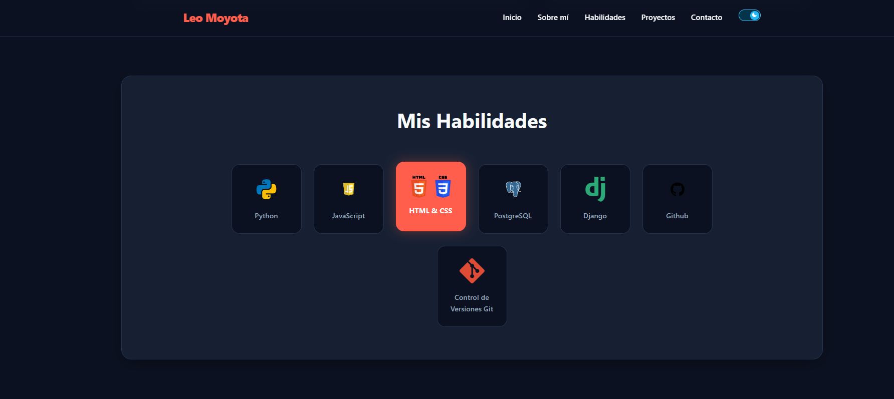
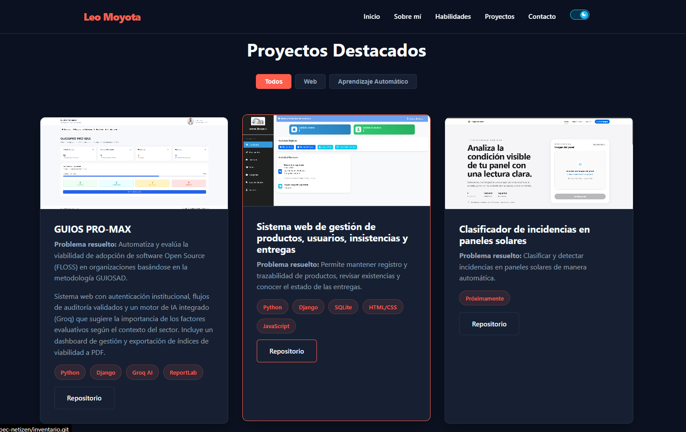
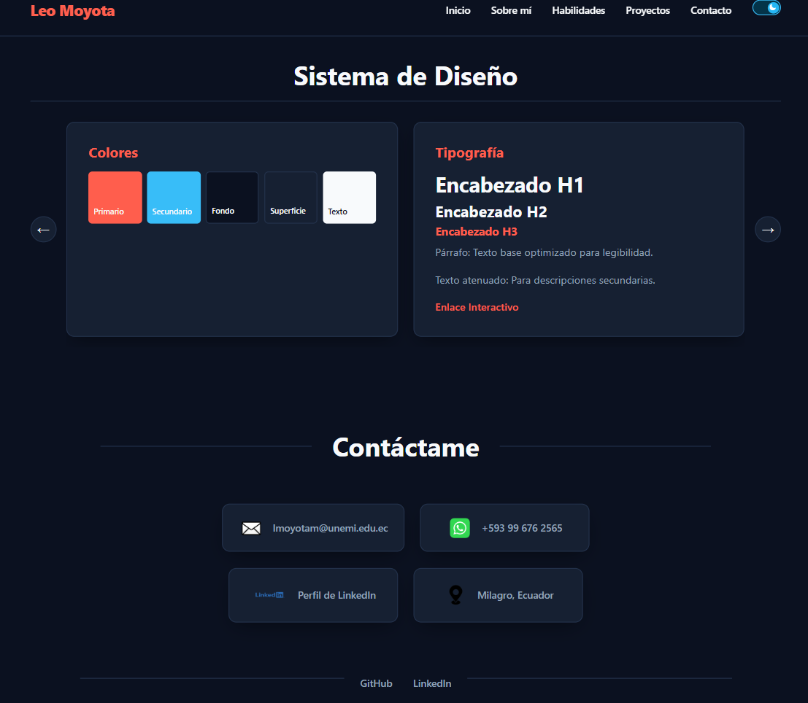

# 🚀 Portafolio Profesional | Leo Moyota Martinez

Bienvenido al repositorio de mi portafolio web personal. Como estudiante de Ingeniería de Software en la UNEMI, construí este espacio no solo para exhibir mis proyectos, sino para demostrar mi capacidad de desarrollar interfaces limpias, mantenibles y de alto rendimiento desde cero, sin depender de librerías o frameworks CSS externos.

Puedes explorar mi trabajo enfocado en arquitectura backend (Python/Django), Machine Learning y desarrollo de videojuegos.

##  Características Destacadas

Este proyecto fue desarrollado poniendo especial atención a los detalles técnicos y la experiencia de usuario:

*  Modo Oscuro Interactivo: Implementación nativa con variables CSS y un interruptor animado (Sol/Luna) renderizado y calculado puramente con CSS. La preferencia del usuario se guarda localmente mediante localStorage.
*  Filtrado de Proyectos Dinámico: Motor de búsqueda por categorías (Web, ML, Juegos) construido con Vanilla JavaScript, garantizando transiciones de estado fluidas y reflows controlados en el DOM.
*  Sistema de Diseño Integrado: Documentación viva dentro de la misma página. Incluye un carrusel interactivo que expone la paleta de colores, la escala tipográfica y los componentes reutilizables (UI Kit).
*  Arquitectura CSS Escalable: Uso extensivo de CSS Custom Properties (variables), Flexbox y Grid para un diseño 100% responsivo y semántico.

##  Stack Tecnológico

Estructura del Portafolio:
* HTML5 (Semántico y accesible)
* CSS3 (Animaciones, variables globales, diseño fluido)
* JavaScript (ES6+, manipulación del DOM, eventos)

Tecnologías aplicadas en mis proyectos (Documentados aquí):
* Backend & BD: Python, Django, PostgreSQL, SQLite
* Data & IA: Scikit-learn (Isolation Forest/Random Forest), Groq AI API
* Game Dev: Unity, C#, LibreSprite

## Estructura del Proyecto

```text
Portafolio/
├── index.html
├── README.md
├── css/
│   └── styles.css
├── js/
│   └── script.js
└── img/
    ├── lm_no_bg.png
    ├── guioss.png
    ├── sistema_inventario.png
    ├── clasificador.png
    ├── game_placeholder.png
    ├── correo.webp
    ├── whatsapp.webp
    └── [iconos de habilidades, redes sociales y capturas]
```
##  Despliegue y Uso Local

El proyecto es estático y no requiere configuración de servidores, compiladores de assets ni dependencias de Node.js.

1. Clona este repositorio:
   git clone https://github.com/Leomoyotam/portfolio.git

2. Navega al directorio:
   cd portfolio

3. Inicia el proyecto:
   * Simplemente abre el archivo index.html en tu navegador de preferencia.
   * Alternativamente, si usas VS Code, puedes utilizar la extensión Live Server para tener recarga en vivo durante el desarrollo.

## Vistas del Proyecto






##  Conecta conmigo

Actualmente resido en Milagro, Guayas, y estoy abierto a colaborar en proyectos innovadores de software, automatización o desarrollo de videojuegos.

*  Email Institucional: lmoyotam@unemi.edu.ec
*  WhatsApp: https://wa.me/+593996762565
*  LinkedIn: https://www.linkedin.com/in/leo-moyota-martinez-40b412340/
*  GitHub: https://github.com/Leomoyotam

---
Diseñado y desarrollado por Leo Moyota Martinez © 2026